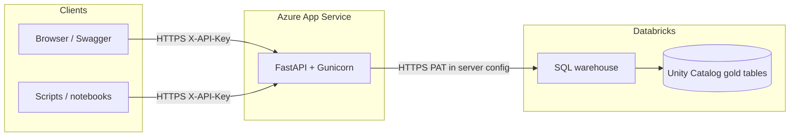
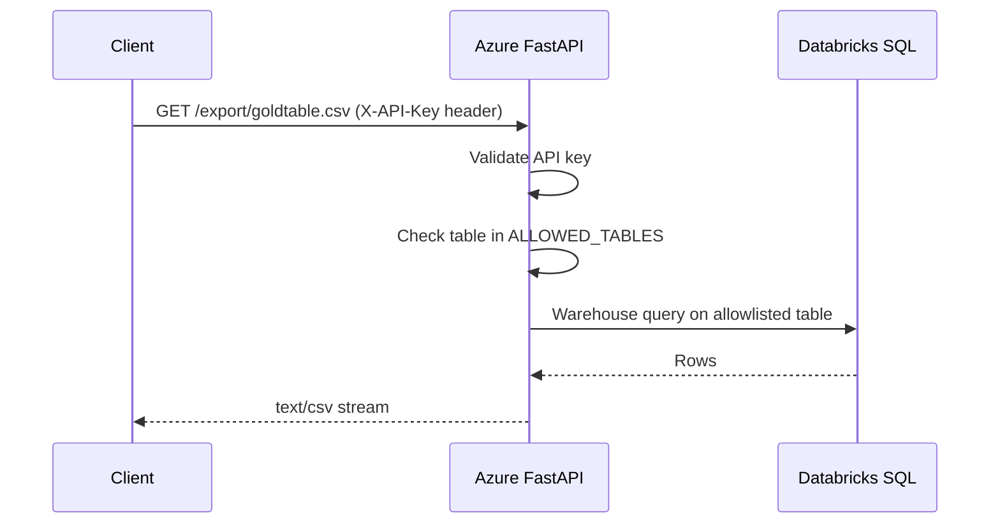
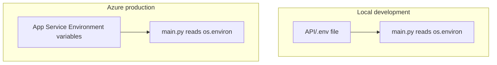
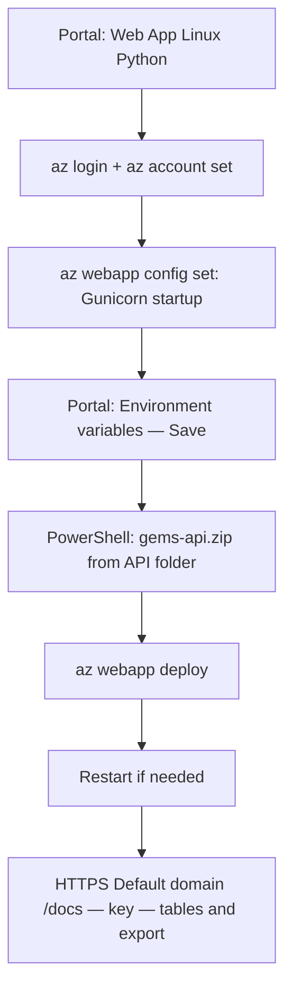

# GEMS Gold Export API

FastAPI service: clients send an **API key** in a header → the service returns **CSV** exports of **allowlisted** Unity Catalog **gold** tables by querying a **Databricks SQL warehouse** with a **personal access token (PAT)** stored on the server.

**Important:** The API loads **`API/.env`** only (same folder as `main.py`). A **repo-root** `.env` is for other project tools; this service does not read it.

---

## Table of contents

1. [What we built (high level)](#1-what-we-built-high-level)
2. [Architecture diagrams](#2-architecture-diagrams)
3. [End-to-end deployment workflow](#3-end-to-end-deployment-workflow)
4. [Prerequisites](#4-prerequisites)
5. [Phase A — Run and test locally](#5-phase-a--run-and-test-locally)
6. [Phase B — Azure App Service](#6-phase-b--azure-app-service)
7. [Phase C — Environment variables (production)](#7-phase-c--environment-variables-production)
8. [Phase D — Package and deploy code](#8-phase-d--package-and-deploy-code)
9. [Phase E — Verify and hand off](#9-phase-e--verify-and-hand-off)
10. [Day-2 operations](#10-day-2-operations)
11. [Troubleshooting](#11-troubleshooting)
12. [Security checklist](#12-security-checklist)
13. [PAT vs service principal](#13-pat-vs-service-principal)
14. [Where commands run: Cloud Shell, Cursor, PowerShell, Portal](#14-where-commands-run-cloud-shell-cursor-powershell-portal)

---

## 1. What we built (high level)

| Piece | Role |
|--------|------|
| **This repo (`API/`)** | Python app: `main.py`, `requirements.txt`, optional `startup.sh`, `.deployment`. |
| **Local machine** | Edit secrets in `API/.env` (gitignored); run with `uvicorn` for development. |
| **Azure App Service (Linux, Python)** | Hosts the same app 24/7; secrets live in **Environment variables** (Application settings), **not** in the zip. |
| **Databricks** | SQL warehouse executes `SELECT * FROM catalog.schema.table` for allowlisted tables; PAT must have access. |

Users never receive the Databricks token. They only use **`X-API-Key`** over **HTTPS** and known URLs such as `/tables` and `/export/{table}.csv`.

---

## 2. Architecture diagrams

### 2.1 System context



### 2.2 Request flow (export CSV)



### 2.3 Configuration split (local vs Azure)



Variable names match in both places: `DATABRICKS_*`, `GEMS_*`, `ALLOWED_TABLES`, `GEMS_API_KEY`, etc.

---

## 3. End-to-end deployment workflow

### How GEMS-API actually went live (Azure-first)

The first production deploy did **not** depend on running the API on a laptop. Secrets and table names were wired in **Azure**, the zip carried only code + build metadata, and we proved everything on the **live** URL. That is a valid path when you already trust the app in git and want the fastest path to a shared HTTPS endpoint.

Roughly, this is the order that worked:

1. **Portal** — Create a **Linux** Web App, **Python 3.11+**, pick region and plan (e.g. with **Always On** if you need it).
2. **Subscription** — In **Cloud Shell** or **PowerShell**, run **`az login`**, then **`az account set --subscription <id>`** so deploy commands hit the right tenant (wrong default subscription causes mysterious **Authorization failed** errors).
3. **Startup** — Set the **Gunicorn** one-liner (**§6**), e.g. with **`az webapp config set ... --startup-file "gunicorn main:app ..."`**. We did **not** rely on **`bash startup.sh`** for that first deploy; the script is optional if you point startup at it.
4. **Portal** — **Environment variables** → add **`DATABRICKS_*`**, **`GEMS_*`**, **`ALLOWED_TABLES`**, **`GEMS_API_KEY`**, etc., then **Save** (values can match what you keep in **`API/.env`** for your own reference — that file never has to run locally first).
5. **Cursor / PowerShell** — Build **`gems-api.zip`** from the **`API`** folder (**§8**): `main.py`, `requirements.txt`, `startup.sh`, `.deployment`, `.env.example` at the **root** of the zip, **no** `.env` / `.venv`.
6. **PowerShell** — **`az webapp deploy`** from the folder that contains the zip (**§8 D.1**), then **Restart** the Web App if needed.
7. **Browser** — Open **`https://<Default domain>/docs`** from **Overview** (not a different `*.azurewebsites.net` that might be another app). **Authorize** with **`X-API-Key`** = **`GEMS_API_KEY`**, then try **`/tables`** and **`/export/{table}.csv`**.

After that, collaborators only need the **default domain** and the shared API key.

### Diagram (same story, compact)



### If you want a safer rehearsal first (optional, recommended for new clones)

Many teams still **copy `.env.example` → `.env`**, run **`uvicorn`** once (**§5**), and hit **`http://127.0.0.1:8000/docs`** before touching Azure. That catches typos in **`ALLOWED_TABLES`** or Databricks settings cheaply. The GEMS-API project simply went **straight to Azure** and debugged with **Log stream** and Swagger on the real host.

### Where each step usually happens

| Step | Where |
|------|--------|
| Optional: local `.env` + **uvicorn** smoke test | **Your PC** — **§5** |
| Create Web App, plan, region | **Azure Portal** |
| **`az account set`**, **`az webapp config set`**, **`az webapp deploy`** | **PowerShell** or **Cursor** terminal (**§14**); **Cloud Shell** for subscription fixes |
| **`DATABRICKS_*`**, **`GEMS_*`**, **`ALLOWED_TABLES`**, **`GEMS_API_KEY`** | **Portal** → **Environment variables** |
| Build **`gems-api.zip`** | **PowerShell** — **§8** |
| Upload zip without CLI | **Kudu** **`/ZipDeploy`** or **File Manager** — **§8 D.2** |
| Confirm the URL you share | **Overview** → **Default domain** |

There is **no automatic sync** from GitHub to Azure Application settings unless you add CI/CD. **Production** values live in the Portal; keep **`.env.example`** in git as documentation only (no real secrets).

---

## 4. Prerequisites

- **Databricks:** PAT (Settings → Developer → Access tokens) and a **SQL warehouse** you may use (**SQL → SQL Warehouses → Connection details**: host + HTTP path).
- **Unity Catalog:** the PAT’s user (or service principal, if you switch later) needs **`SELECT`** on the gold tables you will list in `ALLOWED_TABLES`.
- **Azure:** subscription and rights to create an **App Service** (Web App), Linux, Python 3.11+ (3.12 is fine).
- **Optional:** [Azure CLI](https://learn.microsoft.com/cli/azure/install-azure-cli) on your PC for zip deploy and `az webapp` commands (use the correct subscription: `az account set`). On **Windows**, the same PowerShell commands work in **Cursor’s integrated terminal** once **`az`** is on that terminal’s **`PATH`** (see **[§14.1](#141-cursor-on-windows-azure-cli-in-the-integrated-terminal)** if `az` works in PowerShell but not inside Cursor).

---

## 5. Phase A — Run and test locally

```powershell
cd API
copy .env.example .env
```

Edit **`API/.env`** with real values. **Never commit `.env`.** Do not put secrets in `.env.example`.

| Variable | Purpose |
|----------|---------|
| `DATABRICKS_HOST` | e.g. `adb-123.4.azuredatabricks.net` (no `https://`) |
| `DATABRICKS_HTTP_PATH` | e.g. `/sql/1.0/warehouses/...` |
| `DATABRICKS_TOKEN` | PAT |
| `GEMS_CATALOG` / `GEMS_SCHEMA` | Unity Catalog location of gold tables |
| `ALLOWED_TABLES` | Comma-separated **table names only** (e.g. `goldanimalcharacteristics,goldbodyweight`) |
| `GEMS_API_KEY` | Long random string; clients send it as **`X-API-Key`** |
| `MAX_EXPORT_ROWS` | Optional cap (default `100000` in code if unset) |

Run:

```powershell
python -m venv .venv
.venv\Scripts\activate
pip install -r requirements.txt
uvicorn main:app --reload --host 127.0.0.1 --port 8000
```

Smoke tests:

| URL / action | Expected |
|--------------|----------|
| `http://127.0.0.1:8000/docs` | Swagger UI |
| `GET /health` | `status` ok/degraded + `allowed_table_count` |
| `GET /tables` with header `X-API-Key: <GEMS_API_KEY>` | JSON list of allowed tables |
| `GET /export/<table>.csv` with same header | CSV download |

---

## 6. Phase B — Azure App Service

1. **Azure Portal** → **Create a resource** → **Web App**.
2. **Publish:** Code. **Runtime stack:** Python **3.11** or **3.12**. **OS:** **Linux**.
3. Choose **region** and **App Service plan** (e.g. **Basic B1** or higher if you need **Always On**).
4. After create: note **Resource group** and **Web App name** for CLI commands.

### Startup command

The app must listen on **`0.0.0.0`** (and use **`PORT`** if your platform sets it — this repo’s `startup.sh` defaults to `8000`).

**Option A — `startup.sh` (in zip)**

Portal: **Configuration** → **General settings** → **Startup Command:**

```bash
bash startup.sh
```

**Option B — Gunicorn one-liner (avoids bash/CRLF issues)**

```bash
gunicorn main:app --workers 2 --worker-class uvicorn.workers.UvicornWorker --bind 0.0.0.0:8000
```

If the portal does not show Startup Command, use Azure CLI (replace names):

```bash
az webapp config set --resource-group YOUR_RG --name YOUR_APP --startup-file "gunicorn main:app --workers 2 --worker-class uvicorn.workers.UvicornWorker --bind 0.0.0.0:8000"
az webapp restart --resource-group YOUR_RG --name YOUR_APP
```

Enable **Always On** under **Configuration → General settings** if your plan supports it.

---

## 7. Phase C — Environment variables (production)

**Azure Portal** → your Web App → **Settings** → **Environment variables** → **App settings** → **+ Add** for each row (same names as `.env`).

| Name | Notes |
|------|--------|
| `DATABRICKS_HOST` | No `https://` |
| `DATABRICKS_HTTP_PATH` | Full path from warehouse connection details |
| `DATABRICKS_TOKEN` | PAT |
| `GEMS_CATALOG` / `GEMS_SCHEMA` | If omitted, defaults in code apply |
| `ALLOWED_TABLES` | Comma-separated table names |
| `GEMS_API_KEY` | Shared secret for `X-API-Key` |
| `MAX_EXPORT_ROWS` | Optional |

**Deployment slot setting:** leave **unchecked** unless you use staging slots and need different values per slot.

Click **Save** (app restarts). **Do not** put these values in git or in the deployment zip.

---

## 8. Phase D — Package and deploy code

Deploy so that **`main.py` is at the root of the site** (not inside a nested `API/API` folder). Include `requirements.txt`, `startup.sh` (if used), `.deployment`, and optionally `.env.example`, `.gitattributes`, `DEPLOY_AZURE.md`, `README.md`. **Exclude** `.venv`, `__pycache__`, and **`.env`**.

**Minimal zip (this is what was used for the first GEMS-API deploy)** — run from the **`API`** directory in PowerShell or Cursor’s terminal. The archive name **`gems-api`** is only the filename in `-DestinationPath` (you could pick another name; your deploy step — CLI, Kudu, or extension — must use that file).

```powershell
cd API
Compress-Archive -Force -Path main.py,requirements.txt,startup.sh,.deployment,.env.example -DestinationPath ..\gems-api.zip
```

**Extended zip (same core files, plus optional docs if present)** — useful when you want `.gitattributes`, `DEPLOY_AZURE.md`, and `README.md` inside the package:

```powershell
cd API
$files = @('main.py','requirements.txt','startup.sh','.deployment','.env.example')
if (Test-Path '.gitattributes') { $files += '.gitattributes' }
if (Test-Path 'DEPLOY_AZURE.md') { $files += 'DEPLOY_AZURE.md' }
if (Test-Path 'README.md') { $files += 'README.md' }
Compress-Archive -Force -Path $files -DestinationPath ..\gems-api.zip
```

**On Windows, if you use `startup.sh`:** keep **LF** line endings (this repo includes **`.gitattributes`** for `startup.sh`). CRLF can cause `bash` errors on Azure Linux.

Pick **one** way to push the zip after you build **`gems-api.zip`** (same zip contents for all options).

### D.1 Azure CLI (local PowerShell or Cursor)

From the folder that contains **`gems-api.zip`**:

```powershell
cd "...\data-entry-template"
az webapp deploy --resource-group YOUR_RG --name YOUR_APP --src-path .\gems-api.zip --type zip
```

For **`az login`**, subscription selection, startup, and restart order, see **[§14](#14-where-commands-run-cloud-shell-cursor-powershell-portal)** — including **[§14.1](#141-cursor-on-windows-azure-cli-in-the-integrated-terminal)** if **`az`** is missing only inside Cursor.

### D.2 Azure Portal + Kudu (no CLI on your PC)

Use this when you prefer the browser only (after building **`gems-api.zip`** on your machine).

1. **Azure Portal** → your **Web App** → **Development Tools** → **Advanced Tools** → **Go** (opens **Kudu**, URL contains **`.scm.`**).
2. **Option A — Zip deploy URL:** in the browser go to  
   **`https://<your-app-name>.scm.azurewebsites.net/ZipDeploy`**  
   (use the **same** **`.scm.`** host as Kudu). Sign in if prompted, then **upload** **`gems-api.zip`**.
3. **Option B — File Manager:** in Kudu left menu → **File Manager** → open **`site`** → **`wwwroot`**. If the UI offers **drag a zip to extract & upload**, drop **`gems-api.zip`** so **`main.py`** ends up **directly under `wwwroot`** (not nested inside an extra `API` folder). If old placeholder files remain (e.g. `hostingstart.html`), you may remove them before or after upload, then **Restart** the Web App from the Portal **Overview**.

4. Check **Kudu** home → **Logs** → **View last deployment**, or the Web App **Log stream**, for build errors. **Restart** the Web App if the new code does not load.

**Note:** Portal labels can change slightly; if **`/ZipDeploy`** is not available in your tenant, use **File Manager** + zip drop, or **D.1** / **D.3**.

### D.3 Azure App Service extension (VS Code / Cursor)

1. Install the **Azure App Service** extension (same family of extensions as in VS Code; in Cursor, install from the Extensions view if available).
2. Sign in to Azure from the extension.
3. **Deploy** the **`API`** folder (or your **`gems-api.zip`** per the extension’s flow — follow the wizard). Confirm the deployed site root contains **`main.py`** at the **top level**, not double-nested folders.

This is a **GUI** alternative to **`az webapp deploy`**; you still set **startup command** and **Environment variables** in the Portal (or CLI) as in §6–§7.

---

The **`.deployment`** file enables **`pip install -r requirements.txt`** during deployment on App Service (for zip-based deploys that run Oryx build).

---

## 9. Phase E — Verify and hand off

1. In **Overview**, copy the **Default domain** (e.g. `https://your-app-xxxx.eastus-01.azurewebsites.net`). Use this exact host — a different short name like `something.azurewebsites.net` may be a **different** application entirely.
2. Open **`https://<default-domain>/docs`**.
3. Click **Authorize**, enter **`GEMS_API_KEY`** as the **`X-API-Key`** value (not your Microsoft password).
4. Run **`GET /tables`** to list allowlisted names.
5. Run **`GET /export/{table}.csv`**: set path parameter **`table`** to e.g. `goldanimalcharacteristics` (no `.csv` in the parameter box).

**Collaborators** need: base URL, **`GEMS_API_KEY`**, and optionally **`GET /tables`** to discover names. Example PowerShell:

```powershell
$base = "https://YOUR-DEFAULT-DOMAIN"
$key  = "SHARED_GEMS_API_KEY"
Invoke-RestMethod -Uri "$base/tables" -Headers @{ "X-API-Key" = $key }
Invoke-WebRequest -Uri "$base/export/goldanimalcharacteristics.csv" -Headers @{ "X-API-Key" = $key } -OutFile "goldanimalcharacteristics.csv"
```

---

## 10. Day-2 operations

| Task | Where |
|------|--------|
| Add/remove **allowlisted tables** | Azure **Environment variables** → edit **`ALLOWED_TABLES`** → Save. No redeploy. |
| Rotate **`GEMS_API_KEY`** | Same; update Swagger **Authorize** and all scripts. |
| Change **Databricks PAT** | Edit **`DATABRICKS_TOKEN`** in Azure. |
| **Code** changes | Rebuild zip, redeploy (**§8** D.1 CLI, D.2 Portal/Kudu, or D.3 extension). |
| Document table list for git (no secrets) | Edit **`API/.env.example`** in Cursor and commit. |

---

## 11. Troubleshooting

| Symptom | Likely cause | What to do |
|---------|----------------|------------|
| **`startup.sh: set: -: invalid option`** or bash parse errors | **`startup.sh` saved with CRLF** | Use LF endings, or switch startup to the **Gunicorn one-liner** (§6). |
| **`401` on `/tables` or `/export`** | Wrong or missing **`X-API-Key`** | Must match **`GEMS_API_KEY`** in Azure (or local `.env`). |
| **`403` Table not allowed** | Table not in **`ALLOWED_TABLES`** | Add name in Azure App settings (comma-separated). |
| **`502` Databricks query failed** | Token, warehouse path, firewall, or UC grants | Check **Log stream**; verify PAT and SQL warehouse; Databricks IP allow lists / Private Link. |
| Wrong UI: **Microsoft login**, “Gotham”, **Gems** sidebar | You opened a **different URL** / different Web App | Use **Default domain** from **your** GEMS-API **Overview**. This CSV API uses **API key**, not Entra login in the browser (except whatever the portal itself uses). |
| Swagger: “**Required field** `table`” on export | Empty **`table`** parameter | Type the table name only, e.g. `goldanimalcharacteristics`. |
| Empty **App settings** in Portal after thinking you saved | Changes not saved | **Save** on the Environment variables blade; restart if needed. |

**Diagnostics:** **Portal → Web App → Log stream** (and **Diagnose and solve problems**).

---

## 12. Security checklist

- Keep **`DATABRICKS_TOKEN`**, **`GEMS_API_KEY`**, and **`API/.env`** out of git and out of zip artifacts.
- Use **HTTPS** only for real use; **`HTTPS only`** on the Web App is recommended.
- **`ALLOWED_TABLES`** is the only table names the code uses for user-driven exports — clients cannot pass arbitrary SQL.
- Rotate PAT and API key if exposed (e.g. screenshots with **curl** showing the key).

---

## 13. PAT vs service principal

- **PAT (typical for internal / MVP):** tied to a user; easiest if you can create tokens and have UC **SELECT**. Rotate on leak.
- **Service principal (long-term production):** requires admin setup and UC grants; decouples the API from one person’s account.

---

## 14. Where commands run: Cloud Shell, Cursor, PowerShell, Portal

This section matches the workflow used for **GEMS-API**: what each command does, **where** it was run, and **what you can use instead**.

### 14.1 Cursor on Windows: Azure CLI in the integrated terminal

On Windows, Cursor’s default integrated terminal is **PowerShell**. The same commands as in **standalone Windows PowerShell** apply: **`cd`**, **`Compress-Archive`**, **`az login`**, **`az webapp deploy`**, etc.

If **`az`** works in PowerShell outside Cursor but **`az` is not recognized** inside Cursor, the editor often starts the terminal with a shorter **`PATH`**. Add the Azure CLI **`wbin`** folder to the integrated terminal’s environment (one-time):

1. **Cursor** → **File** → **Preferences** → **Cursor Settings** → open **User settings (JSON)**  
   (file path: `%APPDATA%\Cursor\User\settings.json`).
2. Merge this (preserve other keys in the file):

```json
"terminal.integrated.env.windows": {
    "PATH": "C:\\Program Files\\Microsoft SDKs\\Azure\\CLI2\\wbin;${env:PATH}"
}
```

If Azure CLI is installed elsewhere, set the string to match the folder that contains **`az.cmd`** (from `Get-Command az` in a terminal where `az` already works).

3. **Open a new terminal tab** in Cursor (or restart Cursor), then run **`az version`**.

After that, you can run the full **§14.4** checklist from Cursor without using external PowerShell.

---

### 14.2 Azure Cloud Shell (browser, inside Azure Portal)

**Open it:** Portal top bar → **Cloud Shell** icon → choose **Bash** or **PowerShell**.

**What we used it for (typical):** fixing the **active subscription**. If your default subscription is wrong (e.g. another department’s tenant), `az webapp` commands can fail with **Authorization failed** or target the wrong account. In Cloud Shell (or locally) you run:

```bash
az account set --subscription ed150bce-3150-4fe4-b9e9-557ade4ccef5
```

Replace the GUID with **your** subscription ID (`az account list -o table`). The ID here corresponded to **CALS BoviAnalytics** in our setup.

**Alternatives (same outcome):**

- **Azure Portal** → subscription filter (top bar) → select the correct subscription before using Portal features.
- **Local PowerShell** after `az login`: same `az account set --subscription <id>`.

**Deploying `gems-api.zip` from Cloud Shell:** possible only if the zip is **available inside Cloud Shell** (e.g. uploaded to Cloud Shell storage or fetched from a URL). In practice, **`az webapp deploy --src-path .\gems-api.zip`** is easiest from **your PC** in the folder that contains the zip.

---

### 14.3 Building `gems-api.zip` (Cursor terminal = PowerShell)

The zip is **not** created by Azure; you build it on your machine. **Cursor’s integrated terminal** on Windows is still **PowerShell** — use the **`API`** directory (the folder that contains `main.py`).

**Minimal command (used for the first GEMS-API zip / deploy):**

```powershell
cd API
Compress-Archive -Force -Path main.py,requirements.txt,startup.sh,.deployment,.env.example -DestinationPath ..\gems-api.zip
```

**Extended command (adds `.gitattributes`, `DEPLOY_AZURE.md`, `README.md` when those files exist):**

```powershell
cd API
$files = @('main.py','requirements.txt','startup.sh','.deployment','.env.example')
if (Test-Path '.gitattributes') { $files += '.gitattributes' }
if (Test-Path 'DEPLOY_AZURE.md') { $files += 'DEPLOY_AZURE.md' }
if (Test-Path 'README.md') { $files += 'README.md' }
Compress-Archive -Force -Path $files -DestinationPath ..\gems-api.zip
```

That writes **`gems-api.zip`** in the **parent** of `API` (e.g. repo root `data-entry-template`). Do **not** include `.env`, `.venv`, or `__pycache__`.

**Alternatives:** zip the **same file list** manually in File Explorer (files must sit at the **root** of the zip, not inside a nested `API` folder); or use a CI pipeline that runs an equivalent archive step.

---

### 14.4 PowerShell session on your PC (ordered checklist)

Run these from **Windows PowerShell** or **Cursor’s integrated terminal** (same commands; if **`az`** fails only in Cursor, fix **`PATH`** per **[§14.1](#141-cursor-on-windows-azure-cli-in-the-integrated-terminal)**). **Log in first**, **select subscription**, then configure and deploy the Web App. Replace `GEMS` / `GEMS-API` / subscription ID if yours differ.

| Step | Command (example) | What it does | Alternatives |
|------|-------------------|--------------|--------------|
| 1 | `az version` | Confirms Azure CLI is installed and shows version. | Install from Microsoft docs if missing. |
| 2 | `az login` | Opens browser sign-in; ties CLI to your Azure AD user. | Device code flow, service principal (`az login --service-principal`) for automation. |
| 3 | `az account set --subscription ed150bce-3150-4fe4-b9e9-557ade4ccef5` | Makes all following `az` commands use **this** subscription. | Portal subscription picker; Cloud Shell same command. |
| 4 | `az webapp config set --resource-group GEMS --name GEMS-API --startup-file "gunicorn main:app --workers 2 --worker-class uvicorn.workers.UvicornWorker --bind 0.0.0.0:8000"` | Sets **how Linux starts your app** (Gunicorn + Uvicorn workers, bind `0.0.0.0:8000`). | Portal → Web App → **Configuration** → **General settings** → **Startup Command** (same one-liner or `bash startup.sh`). |
| 5 | `az webapp restart --resource-group GEMS --name GEMS-API` | Restarts the site so config and code reload cleanly. | Portal → Web App → **Overview** → **Restart**; often automatic after saving **Configuration**. |
| 6 | `cd` to folder containing `gems-api.zip`, then `az webapp deploy --resource-group GEMS --name GEMS-API --src-path .\gems-api.zip --type zip` | Uploads the zip; App Service extracts and runs build (`pip install` via `.deployment`). | **§8 D.2:** Kudu **`/ZipDeploy`** or **File Manager** → `site/wwwroot`; **§8 D.3:** **Azure App Service** extension. |

After step 6, open **`https://<default-domain>/docs`** from **Overview** (see §9).

---

## Extra: Azure CLI quick reference

Copy-paste snippets also live in **`DEPLOY_AZURE.md`** in this folder.
