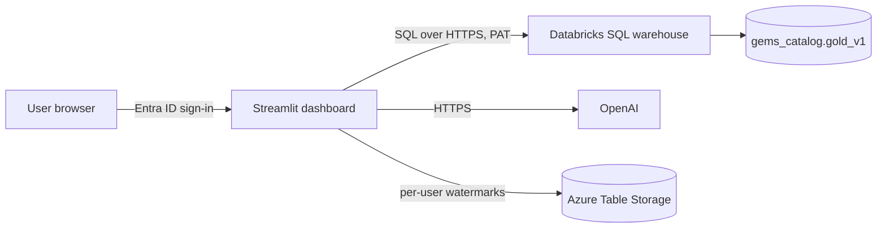

# GEMS Dashboard

Streamlit dashboard that lets authenticated users explore, download, and
statistically model the allowlisted gold tables in `gems_catalog.gold_v1`.

**Standalone:** the dashboard connects directly to a Databricks SQL warehouse
with its own Personal Access Token. It does not depend on the GEMS-API Web App.

Authentication is handled by **Azure App Service built-in Authentication
(Entra ID)**, so the dashboard code itself does not implement any sign-in flow.
The signed-in user's UPN is read from the `X-MS-CLIENT-PRINCIPAL-NAME` header
injected by Easy Auth.

## Pages

1. **Home** (`app.py`) — sign-in banner, Databricks health check, table count.
2. **Explore & Visualize** (`page_explore.py`) — pick a table, inspect columns, preview rows, render Plotly charts, and ask an OpenAI agent to interpret the chart.
3. **Modeling** (`page_modeling.py`) — fit OLS or linear mixed models via `statsmodels`, then ask an OpenAI agent to interpret the results.
4. **Chat** (`page_chat.py`) — Genie-style chatbot: ask questions in plain English. The assistant lists tables, inspects schemas, writes SELECT queries, runs them, and summarizes the results. SQL is validated with `sqlglot` before execution (SELECT/WITH only, allowlisted tables, row cap).
5. **Download** (`page_download.py`) — full or **incremental** CSV download (only new rows since your last download, tracked per user in Azure Table Storage via a watermark column you choose).

## Architecture at a glance



No intermediate API. The dashboard holds the PAT in its App Service env vars
and queries Databricks directly. All SQL goes through either:

- the allowlist check (`list_tables`, `get_schema`, `preview`, `export_csv`), or
- the `sqlglot`-based SELECT validator (`run_sql`, used by the Chat page).

## Local development

```powershell
cd dashboard
copy .env.example .env
# Edit .env with real values — at minimum DATABRICKS_HOST, DATABRICKS_HTTP_PATH,
# DATABRICKS_TOKEN, ALLOWED_TABLES, OPENAI_API_KEY.

python -m venv .venv
.venv\Scripts\activate
pip install -r requirements.txt
streamlit run app.py
```

Open http://localhost:8501. When running locally, Easy Auth headers are
absent, so the dashboard falls back to `LOCAL_DEV_USER` for the "signed-in
user" label.

## Deployment to Azure App Service

### 1. Create the Web App

Azure Portal → Create a resource → Web App:

- **Publish:** Code
- **Runtime:** Python 3.11 or 3.12
- **OS:** Linux
- **Resource group:** any (e.g. reuse the one that holds the GEMS-API)
- **Name:** e.g. `gems-dashboard`

### 2. Turn on Entra ID authentication (no code)

Portal → the new Web App → **Settings → Authentication** → **Add identity provider**:

- **Identity provider:** Microsoft
- **Tenant type:** Workforce (standard Entra ID)
- **Restrict access:** Require authentication
- **Unauthenticated requests:** HTTP 302 Found redirect → Microsoft

To limit who can sign in:

- Portal → **Microsoft Entra ID** → **Enterprise applications** → your dashboard app → **Users and groups** → add allowed users/groups.
- External collaborators: invite them as **Guest users** (B2B), then add to the same assignment.

### 3. Create Azure Table Storage for watermarks

Portal → Create a resource → **Storage account** (StorageV2, Standard LRS is fine).

After creation → **Data storage → Tables** → **+ Table** → name `gemsDownloadWatermarks` (or anything; must match `AZURE_TABLES_NAME`).

Grab the connection string: **Security + networking → Access keys → Connection string**.

### 4. Set environment variables

Portal → the dashboard Web App → **Settings → Environment variables → App settings** → **+ Add**:

| Name | Value |
|------|-------|
| `DATABRICKS_HOST` | e.g. `adb-1234567890.12.azuredatabricks.net` (no `https://`) |
| `DATABRICKS_HTTP_PATH` | e.g. `/sql/1.0/warehouses/abcd...` |
| `DATABRICKS_TOKEN` | PAT with `SELECT` on the gold tables |
| `GEMS_CATALOG` | `gems_catalog` |
| `GEMS_SCHEMA` | `gold_v1` |
| `ALLOWED_TABLES` | comma-separated list of gold table names users may access |
| `OPENAI_API_KEY` | your OpenAI key |
| `OPENAI_MODEL` | used by plot/model interpreters (e.g. `gpt-4o-mini`) |
| `OPENAI_CHAT_MODEL` | used by the Chat page tool-calling agent (e.g. `gpt-4o`) |
| `AZURE_TABLES_CONNECTION_STRING` | from step 3 |
| `AZURE_TABLES_NAME` | `gemsDownloadWatermarks` |

Save (the app restarts).

### 5. Startup command

Same pattern as **GEMS-API** (inline command, bind `0.0.0.0:8000`): set an
**inline** Streamlit command — no shell script path, no `/home/site/wwwroot`
paths. Oryx runs the command from the app folder (often under `/tmp/...` after
extract).

Portal → **Configuration → General settings → Startup Command**:

```bash
python -m streamlit run app.py --server.port 8000 --server.address 0.0.0.0 --server.headless true --browser.gatherUsageStats false
```

If `python` is not on `PATH` after build, use the venv explicitly:

```bash
antenv/bin/python -m streamlit run app.py --server.port 8000 --server.address 0.0.0.0 --server.headless true --browser.gatherUsageStats false
```

Optional: `sh startup.sh` (repo file) resolves `antenv` and `app.py` from the
script directory if you prefer a small shell wrapper.

### 6. Package and deploy

Easiest path is the helper script in [`../tools/deploy_dashboard.ps1`](../tools/deploy_dashboard.ps1), which builds the zip, sets the startup command, deploys, and restarts in one shot:

```powershell
.\tools\deploy_dashboard.ps1 -ResourceGroup YOUR_RG -AppName gems-dashboard
```

If `az webapp deploy` sits on **Starting the site...** for many minutes, upload
asynchronously (then check **Log stream** if the site does not come up):

```powershell
.\tools\deploy_dashboard.ps1 -ResourceGroup YOUR_RG -AppName gems-dashboard -AsyncDeploy
```

Equivalent manual steps (PowerShell or Cursor terminal) — run from the repo root:

```powershell
cd dashboard
Compress-Archive -Force `
  -Path app.py,gems_auth.py,gems_data.py,gems_ui.py,gems_stats.py,gems_ai.py,gems_chat.py,gems_watermarks.py,page_explore.py,page_modeling.py,page_chat.py,page_download.py,assets,.streamlit,requirements.txt,startup.sh,.deployment,.env.example,.gitattributes,README.md `
  -DestinationPath ..\gems-dashboard.zip

cd ..
$start = 'python -m streamlit run app.py --server.port 8000 --server.address 0.0.0.0 --server.headless true --browser.gatherUsageStats false'
az webapp config set --resource-group YOUR_RG --name gems-dashboard --startup-file $start
az webapp deploy --resource-group YOUR_RG --name gems-dashboard --src-path .\gems-dashboard.zip --type zip
# Add `--async true` if the sync poll hangs.
az webapp restart --resource-group YOUR_RG --name gems-dashboard
```

Alternatives (Kudu `/ZipDeploy`, File Manager drag-and-drop, VS Code / Cursor Azure App Service extension) all work — follow the same patterns documented in [API/README.md](../API/README.md) §8.

### 7. Verify

From **Overview**, copy the **Default domain** (e.g. `https://gems-dashboard-xxxx.eastus-01.azurewebsites.net`) and open it. You should be redirected to Microsoft sign-in; after signing in you land on the Home page with a green "Connected" banner.

## Updating the dashboard after it's live

**Edit the files in `dashboard/` on your local machine — nowhere else.** The
deployed Web App is just a copy of this folder; every change is shipped by
rebuilding the zip and redeploying. Never edit files through the Azure Portal
File Manager or Kudu directly — those edits get overwritten the next time you
deploy and there's no history.

The normal loop is:

1. Edit files locally (e.g. a `page_*.py` script, a helper in
   `dashboard/gems_*.py` helpers, or `app.py`).
2. Test locally:
   ```powershell
   cd dashboard
   .venv\Scripts\activate
   streamlit run app.py
   ```
3. Commit the change (recommended: keep `dashboard/.env` out of git; only the
   deployed Web App needs the real secrets, which live in its Environment
   variables).
4. Redeploy with the helper script:
   ```powershell
   .\tools\deploy_dashboard.ps1 -ResourceGroup YOUR_RG -AppName gems-dashboard
   ```
   It rebuilds `gems-dashboard.zip`, pushes it via `az webapp deploy`, and
   restarts the Web App. Downtime is usually <60 seconds.

**What goes where:**

| Change | File(s) to edit |
|--------|------------------|
| Text, headings, cards on the landing page | `dashboard/app.py` |
| Table explore / charts | `dashboard/page_explore.py` |
| Modeling page (OLS / MixedLM, join logic, fit statistics) | `dashboard/page_modeling.py` |
| Chat agent UI | `dashboard/page_chat.py` |
| Download CSV behaviour | `dashboard/page_download.py` |
| Databricks queries, redacted columns, display names | `dashboard/gems_data.py` |
| Statsmodels wrappers, R² / AIC / BIC computation | `dashboard/gems_stats.py` |
| AI prompts (plot / model interpretation, chat system prompt) | `dashboard/gems_ai.py`, `dashboard/gems_chat.py` |
| Theme colors, fonts, card/hero styling | `dashboard/.streamlit/config.toml`, `dashboard/gems_ui.py` |
| Watermark storage (incremental downloads) | `dashboard/gems_watermarks.py` |
| Python dependencies (new packages) | `dashboard/requirements.txt` |

**Secrets-only changes** (e.g. rotating the Databricks PAT, swapping the
OpenAI key, changing `ALLOWED_TABLES`) don't need a redeploy. Just update the
value in Azure Portal → **Web App → Settings → Environment variables** and
the app restart is automatic.

Check the running app's logs any time with:

```powershell
az webapp log tail --resource-group YOUR_RG --name gems-dashboard
```

## Security notes

- `DATABRICKS_TOKEN`, `OPENAI_API_KEY`, and `AZURE_TABLES_CONNECTION_STRING` live in **Environment variables**, never in the zip or in git.
- Users never see the PAT or the OpenAI key; they only interact with `https://<dashboard-domain>`.
- Easy Auth enforces sign-in before any Streamlit route is served.
- Incremental downloads only permit watermark columns that actually exist on the table (validated against `DESCRIBE TABLE`).
- Chat-page SQL is parsed with `sqlglot`: rejects anything that isn't a single SELECT/WITH, rejects DDL/DML keywords, and requires every table reference to be allowlisted (or a CTE name).

## Relation to the GEMS-API

This dashboard is fully independent of the GEMS Gold Export API (`../API/`).
Both query the same Databricks gold tables with the same PAT, but they serve
different consumers:

- **GEMS-API**: machine clients (scripts, notebooks) hitting HTTPS endpoints with `X-API-Key`.
- **Dashboard**: human users signed in with Entra ID.

You can run one without the other. Keep the PAT and `ALLOWED_TABLES` in sync
between their environment-variable sets and there's a single source of truth
operationally.

## Troubleshooting

| Symptom | Likely cause | What to do |
|--------|--------------|-----------|
| Redirect loop on sign-in | App Service Authentication misconfigured | Portal → Authentication → remove and re-add Microsoft provider; confirm "Require authentication". |
| "Data source not configured" | `DATABRICKS_*` env vars missing | Set `DATABRICKS_HOST`, `DATABRICKS_HTTP_PATH`, `DATABRICKS_TOKEN`. |
| "No tables available" on every page | `ALLOWED_TABLES` empty | Set it to the comma-separated list of gold table names. |
| 502 / connection errors on a page | PAT expired or warehouse stopped | Check Databricks token; warehouse auto-starts on first query but may need a moment. |
| Chat keeps writing SQL that fails validation | Model forgetting to use `gems_catalog.gold_v1` prefix | Set `OPENAI_CHAT_MODEL` to a stronger model; system prompt already enforces the rule. |
| Incremental download disabled message | `AZURE_TABLES_CONNECTION_STRING` missing | Provision a Storage account and add the connection string. |
| `sh startup.sh` / `bash startup.sh` parse errors | CRLF line endings | Keep LF (`.gitattributes` enforces this); or use the inline `antenv/bin/python -m streamlit ...` one-liner. |
| `ModuleNotFoundError` for a package folder under the dashboard | Oryx compressed output can omit subpackages next to `app.py` | Helpers live as root-level `gems_*.py` files (same idea as `main.py` for the API) so every module is deployed. |
| Sidebar has no page links; landing HTML looks like source code | Oryx can omit `pages/`; indented HTML is parsed as a Markdown code block | Pages are root-level `page_*.py` + `st.navigation` in `app.py`; HTML blocks use `textwrap.dedent`. |
