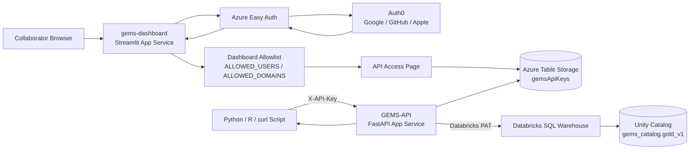
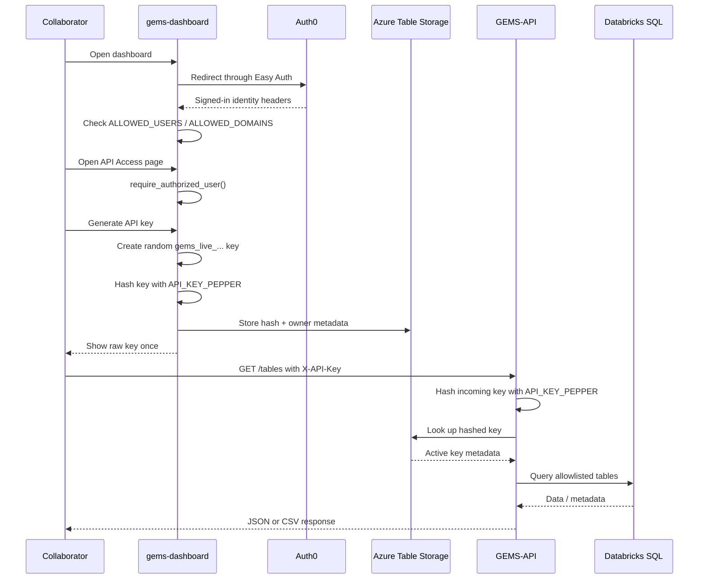

# GEMS Dashboard + API Access Integration Note

## Purpose

This note documents the current design that connects the Streamlit dashboard (`gems-dashboard`) with the FastAPI data service (`GEMS-API`) through shared API-key storage.

The goal is to let authorized collaborators:

1. sign in to the dashboard with Auth0,
2. pass the dashboard allowlist check,
3. generate a personal API key,
4. use that key from Python, R, curl, or other tools,
5. query/download GEMS gold data from the API,
6. refresh local files only when the Databricks gold table version changes.

This replaces the old dashboard Download page. The dashboard now focuses on interactive exploration/modeling/chat plus API key management. Programmatic data access is handled by the API.

## High-Level Decision

Keep two Azure App Services:

- `gems-dashboard`
  - Streamlit web app.
  - Auth0 sign-in through Azure App Service Authentication / Easy Auth.
  - In-app allowlist via `ALLOWED_USERS` / `ALLOWED_DOMAINS`.
  - API Access page for generating/revoking user API keys.

- `GEMS-API`
  - FastAPI web app.
  - No browser login requirement.
  - Accepts data requests with `X-API-Key`.
  - Validates keys against Azure Table Storage.
  - Queries Databricks SQL warehouse for allowlisted gold tables.

Do not combine Streamlit and FastAPI into one app right now. They have different runtime patterns and different authentication needs.

## Why This Design

### Why not keep only dashboard downloads?

The old Download page was useful for one-off browser CSV exports, but collaborators also need programmatic access from:

- Python scripts,
- R scripts,
- notebooks,
- local analysis pipelines,
- reproducible workflows.

An API key workflow is more flexible and easier to automate.

### Why not put FastAPI inside the dashboard App Service?

Streamlit and FastAPI normally run as different web servers:

- Streamlit: `streamlit run app.py`
- FastAPI: `uvicorn` / `gunicorn main:app`

Putting both into one Azure App Service would require custom routing or a reverse proxy. It also creates an authentication problem: the dashboard should use Auth0/Easy Auth, while the API should allow simple script access with only `X-API-Key`.

Keeping them separate is simpler:

- dashboard security = Auth0 login + allowlist,
- API security = API key validation.

### Why shared Azure Table Storage?

The dashboard needs to create/revoke API keys.

The API needs to validate API keys.

They need one shared source of truth. Azure Table Storage is already available in the project and is simple for this small collaborator group.

## Architecture Diagram



## Request Flow



## Key Security Model

### Dashboard access

The dashboard uses:

- Auth0 as the identity provider,
- Azure App Service Authentication / Easy Auth as the web-app authentication layer,
- `ALLOWED_USERS` / `ALLOWED_DOMAINS` as the in-app data access gate.

Users who are signed in but not allowlisted can see the general dashboard shell/home page, but cannot access:

- Explore,
- Modeling,
- Chat,
- API Access.

### API key access

API keys are only generated from the dashboard API Access page, and that page calls:

```python
require_authorized_user()
```

So unauthorized users cannot generate API keys.

The API validates keys by:

1. reading the `X-API-Key` header,
2. requiring the key to start with `gems_live_`,
3. hashing the submitted key with `API_KEY_PEPPER`,
4. looking up the hash in Azure Table Storage,
5. confirming the key is not revoked,
6. optionally confirming the owner is still in `ALLOWED_USERS` / `ALLOWED_DOMAINS` on the API app,
7. allowing the request.

There is no old shared `GEMS_API_KEY` fallback.

## API Key Storage

Azure Table Storage table:

```text
gemsApiKeys
```

Recommended app setting:

```text
AZURE_API_KEYS_TABLE=gemsApiKeys
```

Each API key record stores metadata like:

```text
PartitionKey = api_key
RowKey       = <HMAC-SHA256 hash of raw API key>
owner        = user email
ownerKey     = sanitized normalized user email
name         = user-provided key name
keyPrefix    = visible prefix only, e.g. gems_live_abcd...
createdAt    = ISO timestamp
lastUsedAt   = ISO timestamp or blank
revokedAt    = ISO timestamp or blank
```

The raw key is never stored.

The dashboard displays the raw key once immediately after generation.

## What Is `API_KEY_PEPPER`?

`API_KEY_PEPPER` is a long random server-side secret used when hashing API keys.

It is not provided by Azure. You generate it once.

Generate locally:

```powershell
python -c "import secrets; print(secrets.token_urlsafe(48))"
```

Set the same value in both Azure App Services:

- `gems-dashboard`,
- `GEMS-API`.

Do not commit it, screenshot it, email it, or paste it into chat.

If `API_KEY_PEPPER` differs between the dashboard and API, generated keys will not validate.

## API Base URL

The API base URL is the default domain of the FastAPI App Service, not the dashboard.

Use the target API App Service default domain or custom domain:

```text
https://<api-default-domain>
```

Set this only on the dashboard app:

```text
GEMS_API_BASE_URL=https://<api-default-domain>
```

The dashboard displays this value on the API Access page and inserts it into Python/R examples. For each deployment, copy the default domain from the target API App Service Overview page or use the API's custom domain. Do not reuse a hostname from another environment.

## Azure Configuration

### 1. Azure Table Storage

Create or reuse a Storage Account.

Create table:

```text
gemsApiKeys
```

Copy the Storage Account connection string from:

```text
Storage Account -> Security + networking -> Access keys -> Connection string
```

Treat this as a secret.

### 2. `gems-dashboard` App Service settings

Azure Portal:

```text
gems-dashboard -> Settings -> Environment variables -> App settings
```

Required for API Access:

```text
AZURE_TABLES_CONNECTION_STRING=<storage connection string>
AZURE_API_KEYS_TABLE=gemsApiKeys
API_KEY_PEPPER=<same long random secret as API>
GEMS_API_BASE_URL=https://<api-default-domain>
```

Also required for dashboard data pages:

```text
DATABRICKS_HOST=<workspace host, no https://>
DATABRICKS_HTTP_PATH=<SQL warehouse HTTP path>
DATABRICKS_TOKEN=<Databricks PAT>
GEMS_CATALOG=gems_catalog
GEMS_SCHEMA=gold_v1
ALLOWED_TABLES=goldanimalcharacteristics,goldbodyweight,...
OPENAI_API_KEY=<if chat/AI features are used>
OPENAI_MODEL=gpt-4o-mini
OPENAI_CHAT_MODEL=gpt-4o
ALLOWED_USERS=<comma-separated authorized emails>
ALLOWED_DOMAINS=<optional comma-separated domains>
```

Authentication for `gems-dashboard`:

```text
Auth0 through Azure App Service Authentication / Easy Auth
```

### 3. `GEMS-API` App Service settings

Azure Portal:

```text
GEMS-API -> Settings -> Environment variables -> App settings
```

Required:

```text
AZURE_TABLES_CONNECTION_STRING=<same storage connection string>
AZURE_API_KEYS_TABLE=gemsApiKeys
API_KEY_PEPPER=<same long random secret as dashboard>
DATABRICKS_HOST=<workspace host, no https://>
DATABRICKS_HTTP_PATH=<SQL warehouse HTTP path>
DATABRICKS_TOKEN=<Databricks PAT>
GEMS_CATALOG=gems_catalog
GEMS_SCHEMA=gold_v1
ALLOWED_TABLES=goldanimalcharacteristics,goldbodyweight,...
MAX_EXPORT_ROWS=100000
```

Recommended:

```text
ALLOWED_USERS=<same as dashboard>
ALLOWED_DOMAINS=<same as dashboard, if used>
```

If `ALLOWED_USERS` / `ALLOWED_DOMAINS` are set on the API app, the API rejects keys whose owners are no longer authorized.

Authentication for `GEMS-API`:

```text
App Service Authentication disabled
```

or:

```text
Allow unauthenticated requests
```

This is intentional. FastAPI itself protects data endpoints with `X-API-Key`.

Do not put Auth0/Easy Auth in front of the API unless you intentionally want users to manage OAuth tokens in addition to API keys.

## Auth0 / Easy Auth Dashboard Setup

For `gems-dashboard`, Auth0 is configured as a custom OpenID Connect provider in Azure App Service Authentication.

Use:

```text
Provider type: OpenID Connect
Provider name: auth0
Metadata URL: https://<auth0-domain>/.well-known/openid-configuration
Issuer URL: https://<auth0-domain>/
Scopes: openid profile email
```

Auth0 Application settings should include the dashboard callback:

```text
https://<dashboard-default-domain>/.auth/login/auth0/callback
```

Each URL must match the target dashboard App Service default domain or custom domain. Do not copy callback/logout URLs from another deployment.

Allowed logout URLs should include:

```text
https://<dashboard-default-domain>/
https://<dashboard-default-domain>/.auth/logout
https://<dashboard-default-domain>/.auth/logout/complete
```

Allowed Web Origins:

```text
https://<dashboard-default-domain>
```

## Code Changes

### Dashboard files

- `dashboard/app.py`
  - Removed Download navigation.
  - Added API Access navigation.
  - Updated homepage card and authentication text.

- `dashboard/page_api_access.py`
  - New Streamlit page for API-key management and user documentation.
  - Uses `require_authorized_user()`.
  - Generates API keys.
  - Lists keys.
  - Revokes keys.
  - Shows base URL and endpoint reference.
  - Provides Python/R examples, including all-table version-aware refresh.

- `dashboard/gems_api_keys.py`
  - Generates random keys with Python `secrets`.
  - Hashes raw keys with HMAC-SHA256 using `API_KEY_PEPPER`.
  - Stores hashed records in Azure Table Storage.
  - Lists keys by owner.
  - Revokes keys by setting `revokedAt`.

- `dashboard/page_download.py`
  - Deleted.

- `dashboard/.env.example`
  - Added API-key storage variables.

- `dashboard/README.md`
  - Updated architecture and file inventory.

- `dashboard/note.md`
  - Updated operational history and setup notes.

- `tools/deploy_dashboard.ps1`
  - Packaging list updated to include `page_api_access.py` and `gems_api_keys.py`.
  - Removed `page_download.py`.

### API files

- `API/main.py`
  - Removed old shared `GEMS_API_KEY` authentication.
  - Added Azure Table Storage API-key validation.
  - Added revoked-key rejection.
  - Added optional owner allowlist check.
  - Added `GET /version/{table}`.
  - Added `GET /versions`.

- `API/requirements.txt`
  - Added `azure-data-tables`.

- `API/.env.example`
  - Removed `GEMS_API_KEY`.
  - Added table-backed API-key settings.

- `API/README.md`
  - Updated API authentication and deployment notes.

## API Endpoints

All data endpoints require:

```text
X-API-Key: gems_live_...
```

Endpoints:

| Method | Endpoint | Purpose |
|---|---|---|
| `GET` | `/health` | Server configuration status. |
| `GET` | `/tables` | List allowed table names. |
| `GET` | `/version/{table}` | Get latest Delta table version for one table. |
| `GET` | `/versions` | Get latest Delta table versions for all allowed tables. |
| `GET` | `/schema/{table}` | Get table columns and types. |
| `GET` | `/preview/{table}?limit=100` | Preview rows as JSON. |
| `GET` | `/export/{table}.csv` | Download full table snapshot as CSV. |
| `POST` | `/query` | Run constrained read-only SQL against allowlisted tables. |

## Table Version Strategy

The API uses Databricks Delta table history as the table-change detector.

For one table:

```sql
DESCRIBE HISTORY gems_catalog.gold_v1.<table> LIMIT 1
```

The API returns:

```json
{
  "table": "goldbodyweight",
  "catalog": "gems_catalog",
  "schema": "gold_v1",
  "version": 12,
  "timestamp": "2026-04-16T00:13:27.923Z",
  "operation": "WRITE"
}
```

Why this approach:

- No need to modify gold tables.
- No need for watermark columns.
- No expensive full-table hash.
- Handles old rows changing.
- Handles deleted rows.
- User scripts can overwrite local files when the version changes.

This assumes the gold tables are Delta tables and changes create Delta history versions.

## User-Facing Refresh Workflow

The API Access page includes all-table refresh scripts.

The script does:

1. call `/tables`,
2. loop through each table,
3. call `/version/{table}`,
4. compare remote version to local metadata file,
5. if unchanged, print that the table is up to date,
6. if changed or missing locally, call `/export/{table}.csv`,
7. overwrite the local CSV,
8. save local metadata JSON.

Local files look like:

```text
gems_data/goldbodyweight.csv
gems_data/goldbodyweight.metadata.json
```

Example output:

```text
Checking GEMS tables...
goldanimalcharacteristics is already up to date. version=8
goldbodyweight has a newer version. local=12 remote=13. Downloading...
Saved gems_data/goldbodyweight.csv
goldcontributor has no local copy. Downloading version 3...
Saved gems_data/goldcontributor.csv
Done. Updated 2 table(s); skipped 1 table(s).
```

## Local Testing Commands

PowerShell:

```powershell
$env:GEMS_API_KEY = "gems_live_YOUR_REAL_KEY"
$env:GEMS_API_BASE = "https://<api-default-domain>"

curl.exe -H "X-API-Key: $env:GEMS_API_KEY" "$env:GEMS_API_BASE/tables"
curl.exe -H "X-API-Key: $env:GEMS_API_KEY" "$env:GEMS_API_BASE/version/goldbodyweight"
curl.exe -L -H "X-API-Key: $env:GEMS_API_KEY" "$env:GEMS_API_BASE/export/goldbodyweight.csv" -o goldbodyweight.csv
Get-Item .\goldbodyweight.csv
```

Command Prompt:

```cmd
set "GEMS_API_KEY=gems_live_YOUR_REAL_KEY"
set "GEMS_API_BASE=https://<api-default-domain>"

curl -H "X-API-Key: %GEMS_API_KEY%" "%GEMS_API_BASE%/tables"
curl -H "X-API-Key: %GEMS_API_KEY%" "%GEMS_API_BASE%/version/goldbodyweight"
curl -L -H "X-API-Key: %GEMS_API_KEY%" "%GEMS_API_BASE%/export/goldbodyweight.csv" -o goldbodyweight.csv
dir goldbodyweight.csv
```

Important PowerShell note:

`curl` in PowerShell is often an alias for `Invoke-WebRequest`. Use `curl.exe` for real curl behavior.

## Deployment Commands

### Dashboard

From repo root:

```powershell
.\tools\deploy_dashboard.ps1 -ResourceGroup GEMS -AppName gems-dashboard -AsyncDeploy
```

If running from Command Prompt:

```cmd
powershell.exe -NoProfile -ExecutionPolicy Bypass -File ".\tools\deploy_dashboard.ps1" -ResourceGroup "GEMS" -AppName "gems-dashboard" -AsyncDeploy
```

### API

From repo root in PowerShell:

```powershell
cd API
Compress-Archive -Force -Path main.py,requirements.txt,startup.sh,.deployment,.env.example -DestinationPath ..\gems-api.zip
cd ..
az webapp deploy --resource-group GEMS --name GEMS-API --src-path .\gems-api.zip --type zip --async true
az webapp restart --resource-group GEMS --name GEMS-API
```

If the App Service name is lowercase in Azure, use:

```powershell
az webapp deploy --resource-group GEMS --name gems-api --src-path .\gems-api.zip --type zip --async true
az webapp restart --resource-group GEMS --name gems-api
```

## Verification Checklist

### Dashboard

1. Open:

```text
https://<dashboard-default-domain>
```

2. Confirm Auth0 login works.
3. Confirm navigation shows `API Access`.
4. Confirm the old `Download` page is gone.
5. Confirm allowlisted user can open API Access.
6. Confirm non-allowlisted signed-in user is blocked from API Access.
7. Generate a test API key.
8. Revoke a test API key and confirm it stops working.

### API

1. Open:

```text
https://<api-default-domain>/docs
```

2. Authorize with a generated `gems_live_...` key.
3. Test:

```text
GET /tables
GET /version/goldbodyweight
GET /export/goldbodyweight.csv
```

## Troubleshooting

### Dashboard says API key storage is not configured

Check `gems-dashboard` App Settings:

```text
AZURE_TABLES_CONNECTION_STRING
AZURE_API_KEYS_TABLE
API_KEY_PEPPER
```

### API returns 500: API key storage not configured

Check `GEMS-API` App Settings:

```text
AZURE_TABLES_CONNECTION_STRING
AZURE_API_KEYS_TABLE
API_KEY_PEPPER
```

### API returns 401

Likely causes:

- wrong key,
- key not copied fully,
- key revoked,
- `API_KEY_PEPPER` differs between dashboard and API,
- dashboard and API use different storage accounts,
- dashboard and API use different `AZURE_API_KEYS_TABLE` values.

### API returns 403: key owner no longer authorized

The API app has `ALLOWED_USERS` / `ALLOWED_DOMAINS` configured and the key owner is not included.

Fix the allowlist on `GEMS-API`, or intentionally leave the key blocked.

### API returns 403: table not allowed

The table is missing from:

```text
ALLOWED_TABLES
```

on the API app.

### `/version/{table}` returns 502

Likely causes:

- Databricks PAT lacks permission for `DESCRIBE HISTORY`,
- wrong `GEMS_CATALOG`,
- wrong `GEMS_SCHEMA`,
- table is not Delta,
- SQL warehouse is unavailable.

### CSV export creates a file but content is an error page

Open the file and inspect the first few lines. If it contains HTML or JSON error text, the request failed. Check status code and API logs.

### PowerShell curl issue

Use:

```powershell
curl.exe
```

not:

```powershell
curl
```

because PowerShell aliases `curl` to `Invoke-WebRequest`.

## Security Notes

- Do not store raw API keys.
- Do not commit API keys.
- Do not paste API keys into screenshots or chat.
- Store user keys locally as environment variables.
- Revoke exposed keys from the dashboard API Access page.
- Rotate `API_KEY_PEPPER` only if the server-side hashing secret is exposed. Rotating it invalidates all existing API keys.
- Keep `AZURE_TABLES_CONNECTION_STRING`, `API_KEY_PEPPER`, and `DATABRICKS_TOKEN` out of Git.

## Current Successful Test

The full flow was tested manually:

1. Dashboard API Access generated a key.
2. API accepted that key with `X-API-Key`.
3. `/tables` worked.
4. `/version/goldbodyweight` worked.
5. `/export/goldbodyweight.csv` worked.
6. The temporary local test CSV was deleted afterward.

## Future Improvements

Possible later improvements:

- Add key expiration dates.
- Add max active keys per user.
- Add admin-only key audit page.
- Add API usage logging by key owner.
- Add downloadable script files from the API Access page.
- Add API rate limiting if collaborator usage grows.
- Add a `/versions`-based optimized all-table sync script that fetches all versions in one API call instead of one call per table.
- Move Databricks access from PAT to service principal if the project becomes more production-governed.