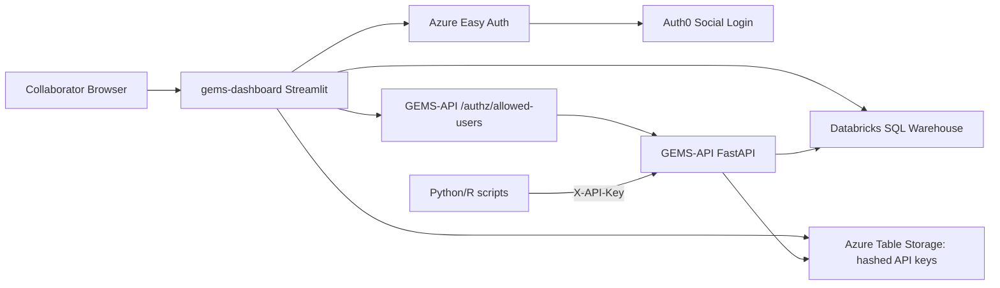

# GEMS Dashboard/API v2 Branch Notes

Branch: `dashboard-v2-improvements`

This note summarizes the main architecture, code, configuration, and operational changes made while improving the GEMS dashboard and API integration. It is intended as a handoff document for future development, deployment, troubleshooting, and collaborator onboarding.

Related original note: `note_api_dashboard.md`

## 1. Executive Summary

The v2 branch improves the dashboard from a basic authenticated data portal into a more complete project portal with:

- Auth0 login through Azure App Service Authentication / Easy Auth.
- Email-verification enforcement before users receive data-tier dashboard access.
- A separate API-tier access model using `GEMS-API.ALLOWED_API_USERS`.
- Per-user API keys generated from the dashboard and validated by the FastAPI API.
- Version-aware Python and R download examples for collaborators.
- Databricks-hosted LLM usage instead of a developer's personal OpenAI key.
- A safer tool-calling chat agent that only sends aggregate results to the LLM.
- Live landing-page statistics and a persisted geocache for the contributing-site map.
- Better table labels, nicer AI interpretation rendering, and stronger deployment packaging.

The most important final access-control rule is:

```text
gems-dashboard.ALLOWED_USERS
  -> controls dashboard data pages: Explore, Modeling, Chat.

GEMS-API.ALLOWED_API_USERS
  -> controls API-tier users: API Access page, API-key generation, and API data access.

A user must be in both lists to have full dashboard + API functionality.
```

Do not use `GEMS-API.ALLOWED_USERS` for API-tier access in the current final design. The API app now uses `ALLOWED_API_USERS`.

## 2. Final Two-App Architecture

The project continues to use two separate Azure Web Apps:

1. `gems-dashboard`
   - Streamlit dashboard.
   - Auth0 login through Azure Easy Auth.
   - Direct Databricks SQL access for Explore, Modeling, Chat, and Home stats.
   - Generates/revokes per-user API keys.
   - Reads the API-tier list from `GEMS-API` through a shared-secret service endpoint.

2. `GEMS-API`
   - FastAPI service.
   - No browser login requirement.
   - Accepts collaborator scripts through `X-API-Key`.
   - Validates hashed API keys from Azure Table Storage.
   - Confirms the key owner is still in `ALLOWED_API_USERS`.
   - Exports allowed Databricks gold tables.



Why this remains two apps:

- The dashboard is a browser application and uses Easy Auth/Auth0.
- The API is a programmatic service and should accept simple `X-API-Key` calls from Python/R.
- Combining Streamlit and FastAPI into one App Service would require a reverse proxy and would complicate authentication.
- Keeping them separate allows the dashboard to be user-friendly while the API remains script-friendly.

## 3. Final Access-Control Model

### 3.1 Public signed-in tier

Any signed-in Auth0/Easy Auth user can see the dashboard frame/home page.

### 3.2 Dashboard data tier

Controlled by:

```text
gems-dashboard.ALLOWED_USERS
```

A user receives Explore / Modeling / Chat access only if:

```text
email_verified == true
AND
email is in gems-dashboard.ALLOWED_USERS
```

This is implemented through:

- `dashboard/gems_auth.py`
- `dashboard/permissions.py`

### 3.3 API tier

Controlled by:

```text
GEMS-API.ALLOWED_API_USERS
```

A user can see and use the dashboard API Access page only if:

```text
email_verified == true
AND
email is in gems-dashboard.ALLOWED_USERS
AND
email is in GEMS-API.ALLOWED_API_USERS
```

This is intentionally stricter than dashboard access.

Dashboard-only users can explore data, model data, and use chat, but cannot generate API keys or use the API Access page.

API-tier users must be listed in both apps because:

- `gems-dashboard.ALLOWED_USERS` lets them enter the protected dashboard.
- `GEMS-API.ALLOWED_API_USERS` lets them generate/use API keys.

### 3.4 Shared authorization secret

The dashboard asks the API for the API-tier user list using:

```text
GET <GEMS_API_BASE_URL>/authz/allowed-users
X-Dashboard-Authz-Secret: <DASHBOARD_API_AUTHZ_SECRET>
```

Both apps must have the same value:

```text
DASHBOARD_API_AUTHZ_SECRET=<long random shared secret>
```

This value is not from Auth0 or Azure. It is created by the operator as a random secret and stored as an Azure App Setting in both Web Apps.

Generate example in PowerShell:

```powershell
[Convert]::ToBase64String((1..48 | ForEach-Object { Get-Random -Maximum 256 }))
```

Do not commit this value to GitHub.

## 4. Auth0 and Email Verification

Auth0 remains the identity provider, connected to `gems-dashboard` through Azure App Service Authentication / Easy Auth.

The dashboard now reads `email_verified` from the Easy Auth principal claims.

Relevant code:

- `dashboard/gems_auth.py`
- `dashboard/permissions.py`
- `docs/auth.md`

Behavior:

- If a signed-in user is not in `ALLOWED_USERS`, they remain public-tier.
- If a user is in `ALLOWED_USERS` but `email_verified` is false, they are downgraded to public-tier.
- The dashboard shows a verification warning and optionally a resend button.

Verification banner text:

```text
Please verify your email — check your inbox for a verification link from Auth0. Refresh after clicking.
```

The resend button uses Auth0 Management API if configured:

```text
AUTH0_DOMAIN
AUTH0_MANAGEMENT_API_TOKEN
```

or:

```text
AUTH0_DOMAIN
AUTH0_MANAGEMENT_CLIENT_ID
AUTH0_MANAGEMENT_CLIENT_SECRET
```

If these are not configured, the dashboard shows a friendly message and asks the user to use the original Auth0 verification email or contact an administrator.

## 5. API Key System

The old shared `GEMS_API_KEY` approach is not used as a server-side fallback.

The current design uses per-user API keys:

1. API-tier user signs in to the dashboard.
2. Dashboard confirms dashboard access and API-tier access.
3. User generates a key on the API Access page.
4. Dashboard creates a raw key like:

```text
gems_live_<random-secret>
```

5. The raw key is shown only once.
6. Dashboard hashes the key using HMAC-SHA256 and `API_KEY_PEPPER`.
7. The hash and metadata are stored in Azure Table Storage.
8. The raw key is never stored.
9. Python/R scripts send the raw key in:

```text
X-API-Key: gems_live_...
```

10. `GEMS-API` hashes the submitted key with the same `API_KEY_PEPPER`.
11. `GEMS-API` looks up the hash in Azure Table Storage.
12. `GEMS-API` confirms the key is active and the owner is still in `ALLOWED_API_USERS`.

Relevant files:

- `dashboard/gems_api_keys.py`
- `dashboard/page_api_access.py`
- `API/main.py`

Required shared settings in both dashboard and API:

```text
AZURE_TABLES_CONNECTION_STRING=<same storage connection string>
AZURE_API_KEYS_TABLE=gemsApiKeys
API_KEY_PEPPER=<same long random server secret>
```

Important distinction:

- `API_KEY_PEPPER` protects stored hashes. It must be the same in both apps.
- `DASHBOARD_API_AUTHZ_SECRET` protects the dashboard-to-API allowlist check. It must also be the same in both apps.
- These are different secrets with different jobs.

## 6. API Access Page Changes

File:

```text
dashboard/page_api_access.py
```

The old Download page was removed/replaced by the API Access workflow.

The API Access page now provides:

- API-key generation.
- API-key listing.
- API-key revocation.
- API base URL.
- Link to Swagger UI at `/docs`.
- Available table names.
- Quick-start instructions.
- Python all-table refresh script.
- R all-table refresh script.
- Small preview query examples.
- Endpoint reference table.
- Security guidance for storing keys in `.env`.

The page now gates access before showing the key generator:

```text
has_api_access(user_info, user_info.bearer_token)
```

If the user is a dashboard user but not API-tier, it shows:

```text
Your account (<email>) has dashboard access but is not in the API tier.
To request API key access, contact the GEMS team. The administrator must add
your email to ALLOWED_API_USERS on gems-api.
```

The page also pings:

```text
GET <GEMS_API_BASE_URL>/authz/me
```

with the user's bearer token. If the API rejects the token, the page tells the operator to confirm that the same email is in `GEMS-API.ALLOWED_API_USERS` and redeploy/restart the API if needed.

## 7. Python and R Collaborator Scripts

The API Access page now recommends that users store their API key in a `.env` file next to their script:

```text
GEMS_API_KEY="gems_live_your_real_key_here"
```

The examples load that `.env` automatically.

### 7.1 Version-aware all-table refresh

The Python and R all-table scripts:

1. Read `GEMS_API_KEY`.
2. Call `/tables`.
3. For each table, call `/version/{table}`.
4. Compare the remote Delta version with local metadata.
5. If unchanged, skip download.
6. If changed or missing locally, download `/export/{table}.csv`.
7. Overwrite the local CSV snapshot.
8. Write/update `<table>.metadata.json`.

This solves the repeated-download issue without full-table hashing.

The local output tells users whether each table:

- is already up to date,
- has no local copy,
- has a newer remote version,
- was downloaded.

### 7.2 Why Delta table version is used

Earlier options considered included:

- full-file/table hashes,
- row-level hashes,
- max processed timestamp,
- watermarks.

The chosen approach is Delta table version metadata because:

- It avoids hashing millions of rows.
- It changes when Delta table content changes.
- It handles inserts, updates, and deletes.
- It does not require modifying gold tables.
- It is simple for collaborators: rerun the refresh script from time to time.

## 8. GEMS-API Changes

Main file:

```text
API/main.py
```

Important changes:

- Uses `ALLOWED_API_USERS` instead of `ALLOWED_USERS`.
- Rejects API-key owners if `ALLOWED_API_USERS` is empty or if the owner is not listed.
- Adds `/authz/me` for bearer-token API-tier checks.
- Adds `/authz/allowed-users` for dashboard-to-API allowlist checks using `DASHBOARD_API_AUTHZ_SECRET`.
- Supports schema enum values such as `gold_v1`, `gold_v2`, and `gold_v3`.
- Defaults to `gold_v1`.
- Adds table version endpoints using `DESCRIBE HISTORY`.
- Returns schema metadata and preview/export endpoints with schema support.
- Keeps API-key validation through Azure Table Storage and `API_KEY_PEPPER`.

Key endpoint summary:

| Endpoint | Purpose |
|---|---|
| `GET /health` | Basic status and configured schema list |
| `GET /tables` | Allowed table list for the API key |
| `GET /authz/me` | Checks whether bearer-token email is API-tier |
| `GET /authz/allowed-users` | Dashboard-only service endpoint to fetch API-tier allowlist |
| `GET /version/{table}` | Latest Delta version for one table |
| `GET /versions` | Latest Delta versions for all allowed tables |
| `GET /schema/{table}` | Column schema |
| `GET /preview/{table}` | Small JSON preview |
| `GET /export/{table}.csv` | CSV export |
| `POST /query` | Constrained read-only SQL query |

Additional dependency changes:

```text
requests
python-jose[cryptography]
```

These support dashboard-to-API authorization and bearer-token validation.

## 9. Databricks Configuration

Both the dashboard and API use the Databricks SQL Warehouse:

```text
DATABRICKS_HOST
DATABRICKS_HTTP_PATH
DATABRICKS_TOKEN
```

The current default catalog/schema are:

```text
GEMS_CATALOG=gems_catalog
GEMS_SCHEMA=gold_v1
```

The user corrected that the active schema is `gold_v1`, not `gems_schema`.

All chat SQL and dashboard data queries should therefore use:

```text
`gems_catalog`.`gold_v1`.`<table_name>`
```

The SQL warehouse reads from Delta tables; it does not copy or rewrite the source tables when users query data.

## 10. Databricks LLM Migration

The dashboard LLM calls were migrated away from a personal OpenAI API key to a Databricks-hosted model-serving endpoint.

Main file:

```text
dashboard/llm_client.py
```

Default endpoint:

```text
DATABRICKS_LLM_ENDPOINT=databricks-claude-haiku-4-5
```

The client uses the OpenAI SDK pointed at:

```text
{DATABRICKS_HOST}/serving-endpoints
```

and calls:

```text
model=DATABRICKS_LLM_ENDPOINT
```

Required dashboard settings:

```text
DATABRICKS_HOST
DATABRICKS_TOKEN
DATABRICKS_LLM_ENDPOINT
```

There is a local-development fallback to `OPENAI_API_KEY` only if `DATABRICKS_LLM_ENDPOINT` is not set. Production should use Databricks.

Startup health check:

- On dashboard startup, a small `ping` request is sent.
- If it succeeds, logs show the endpoint is reachable.
- If it fails, the dashboard logs a warning but does not crash.

Documentation:

```text
docs/llm.md
```

## 11. Chat Agent v2

Files:

```text
dashboard/gems_chat.py
dashboard/chat_sql.py
dashboard/page_chat.py
dashboard/resources/data_dictionary.json
dashboard/scripts/test_chat_agent.py
tests/test_chat_sql.py
```

The chat page was upgraded into a tool-using agent with strong SQL guardrails.

### 11.1 Privacy rule

Absolute rule:

```text
Never send raw row-level data to the LLM.
```

The LLM may receive:

- table names,
- schema,
- column descriptions,
- table summaries,
- aggregate query results,
- small validated previews only when allowed by the SQL validator.

The LLM should not receive unrestricted raw rows.

### 11.2 Tool layer

Implemented tools:

| Tool | Purpose |
|---|---|
| `list_tables()` | Returns available tables with `full_name`, raw table name, pretty label, and description |
| `describe_table(name)` | Returns full table name, columns, dtypes, descriptions, sample size, and null percentages |
| `run_aggregate_query(sql)` | Runs a validated aggregate SELECT |
| `plot(spec)` | Produces a chart spec from an aggregate result |

The `list_tables()` return shape is:

```json
{
  "full_name": "`gems_catalog`.`gold_v1`.`goldbodyweight`",
  "table": "goldbodyweight",
  "label": "Body Weight",
  "description": "..."
}
```

The `describe_table()` return starts with:

```json
{
  "full_name": "`gems_catalog`.`gold_v1`.`goldbodyweight`",
  "name": "goldbodyweight",
  "description": "...",
  "sample_size": 123,
  "columns": []
}
```

### 11.3 SQL rules

The system prompt now tells the LLM:

```text
ALWAYS use fully-qualified table names with backticks:
`gems_catalog`.`gold_v1`.`<table_name>`
```

It also says:

```text
The ONLY allowed schema is `gold_v1`.
NEVER write `gold.`, `silver.`, `bronze.`, `gems_schema.`, or any other schema prefix.
```

The validator rejects:

- `DROP`
- `DELETE`
- `UPDATE`
- `INSERT`
- `MERGE`
- `ALTER`
- `CREATE`
- `SELECT *`
- SELECT without aggregation
- large raw previews
- invalid schemas
- invalid catalogs
- unknown tables

The max tool-call ceiling was raised to 15 to reduce premature failure, but the prompt also tells the model not to retry the same broken query shape.

### 11.4 Data dictionary

File:

```text
dashboard/resources/data_dictionary.json
```

It was generated from Databricks metadata and currently contains first-draft TODO descriptions. It is intended to be hand-edited over time so the chat assistant has better business context.

Generation tool:

```text
tools/generate_data_dictionary.py
```

## 12. Home Page v2

Main file:

```text
dashboard/app.py
```

The home page was updated to use live Databricks-backed content instead of hard-coded stats.

### 12.1 Live stat cards

The four cards now represent:

1. Partner institutions
2. Studies
3. Animals
4. Date range

Important columns:

```text
AnimalIdentifier
Date
ExperimentalLocation
studyId
```

The code resolves reasonable column variants, but the final expected column names are camel-cased in Delta tables.

Caching:

```python
@st.cache_data(ttl=3600)
```

If a query fails, the dashboard uses the last cached value when available or a friendly loading/fallback value instead of crashing.

### 12.2 Consortium Members section

A new section lists:

- Cornell University
- University of California
- University of Guelph
- ETH Zurich
- University of New England
- Agriculture and Agri-Food Canada

If logo files exist under:

```text
dashboard/assets/logos/
```

the dashboard can render a logo strip. Otherwise it renders styled cards with names.

### 12.3 Contributing-site map

The map now uses:

```text
dashboard/resources/site_geocache.json
```

The geocache shape is:

```json
{
  "<site name as it appears in ExperimentalLocation>": {
    "lat": 42.4534,
    "lon": -76.4735,
    "country": "United States"
  }
}
```

Special handling:

```text
Cornell -> Cornell University, Ithaca, New York, United States
```

The map:

- reads live site names from Databricks,
- joins them to the persisted geocache,
- renders known markers immediately,
- attempts live geocoding for missing sites with a short timeout,
- writes successful new geocodes back to JSON,
- falls back to cached markers if Databricks is unavailable,
- avoids an indefinite loading state.

The one-shot build script is:

```text
dashboard/tools_build_site_geocache.py
```

## 13. Table Name Display Improvements

File:

```text
dashboard/utils.py
```

Added:

```python
prettify_table_name(name: str) -> str
```

Behavior:

| Raw table name | Display label |
|---|---|
| `animalcharacteristics` | `Animal Characteristics` |
| `intakeperday` | `Intake Per Day` |
| `greenfeedrawvisitationdata` | `GreenFeed Raw Visitation Data` |
| `bronzeanimalcharacteristics` | `Animal Characteristics` |
| `goldgreenfeedrawvisitationdata` | `GreenFeed Raw Visitation Data` |

Rules:

- Strip `bronze` / `gold` prefixes from display only.
- Keep raw table names internally for queries.
- Keep `GreenFeed` as one word.
- Insert natural spaces for known lowercase table names, camelCase, and digits.

Tests:

```text
tests/test_prettify_table_name.py
```

## 14. AI Interpretation Rendering

Files:

```text
dashboard/gems_ai.py
dashboard/gems_ui.py
dashboard/page_explore.py
dashboard/page_modeling.py
```

Explore and Modeling interpretations now:

- use the Databricks LLM client,
- instruct the model to return Markdown,
- render with `st.markdown`,
- use a styled AI card,
- include short summary headers,
- include 3-6 key points,
- include a final italic `Caveats:` line.

The model receives summary statistics, chart descriptions, model coefficients, p-values, and fit statistics, not raw data.

## 15. Deployment Packaging Improvements

Dashboard deploy script:

```text
tools/deploy_dashboard.ps1
```

This script now explicitly packages flat dashboard modules and important folders/files, including:

- `permissions.py`
- `llm_client.py`
- `utils.py`
- `chat_sql.py`
- `assets`
- `resources`

Why flat files matter:

Azure zip/Oryx deployment previously missed nested module directories, causing errors such as:

```text
ModuleNotFoundError: No module named 'auth'
ModuleNotFoundError: No module named 'llm'
```

The fix was to use flat modules:

```text
dashboard/permissions.py
dashboard/llm_client.py
```

instead of package directories like:

```text
dashboard/auth/permissions.py
dashboard/llm/client.py
```

## 16. Important Environment Variables

### 16.1 `gems-dashboard`

```text
DATABRICKS_HOST
DATABRICKS_HTTP_PATH
DATABRICKS_TOKEN
GEMS_CATALOG=gems_catalog
GEMS_SCHEMA=gold_v1
ALLOWED_TABLES=<comma-separated table names>
DATABRICKS_LLM_ENDPOINT=databricks-claude-haiku-4-5
AZURE_TABLES_CONNECTION_STRING=<same as API>
AZURE_API_KEYS_TABLE=gemsApiKeys
API_KEY_PEPPER=<same as API>
GEMS_API_BASE_URL=https://<api-default-domain>
DASHBOARD_API_AUTHZ_SECRET=<same as API>
ALLOWED_USERS=<dashboard data users>
AUTH0_DOMAIN=<optional, for resend verification>
AUTH0_MANAGEMENT_API_TOKEN=<optional>
AUTH0_MANAGEMENT_CLIENT_ID=<optional>
AUTH0_MANAGEMENT_CLIENT_SECRET=<optional>
```

### 16.2 `GEMS-API`

```text
DATABRICKS_HOST
DATABRICKS_HTTP_PATH
DATABRICKS_TOKEN
GEMS_CATALOG=gems_catalog
GEMS_SCHEMA=gold_v1
ALLOWED_TABLES=<comma-separated table names>
AZURE_TABLES_CONNECTION_STRING=<same as dashboard>
AZURE_API_KEYS_TABLE=gemsApiKeys
API_KEY_PEPPER=<same as dashboard>
ALLOWED_API_USERS=<API-tier users>
AUTH0_DOMAIN=<Auth0 domain, for /authz/me bearer-token validation>
AUTH0_AUDIENCE=<optional, if configured>
DASHBOARD_API_AUTHZ_SECRET=<same as dashboard>
MAX_EXPORT_ROWS=100000
```

Final rule:

```text
Do not use GEMS-API.ALLOWED_USERS for API-tier access.
Use GEMS-API.ALLOWED_API_USERS.
```

## 17. Deployment Commands

### 17.1 Deploy API

From repo root:

```powershell
cd API
Compress-Archive -Force -Path main.py,requirements.txt,startup.sh,.deployment,.env.example -DestinationPath ..\gems-api.zip
cd ..
az webapp deploy --resource-group GEMS --name GEMS-API --src-path .\gems-api.zip --type zip
az webapp restart --resource-group GEMS --name GEMS-API
```

### 17.2 Deploy dashboard

From repo root:

```powershell
.\tools\deploy_dashboard.ps1 -ResourceGroup GEMS -AppName gems-dashboard -AsyncDeploy
```

After deploy:

- Wait a few minutes for Azure/Oryx startup.
- Check Azure Log stream if there is an error.
- Hard refresh browser with `Ctrl + F5`.

## 18. Smoke Tests and Validation

Commands run locally during this work:

```powershell
python -m py_compile API/main.py dashboard/page_api_access.py dashboard/permissions.py
python -m pytest tests -q
```

Result:

```text
14 passed
```

Specific authorization sanity check:

```text
ALLOWED_API_USERS=pn287@cornell.edu,puchun.niu@nmbu.no

pn287@cornell.edu    -> True
puchun.niu@nmbu.no   -> True
other@example.com    -> False
```

Chat SQL validator tests cover:

- `DROP TABLE`
- `DELETE FROM`
- `SELECT *`
- SELECT without aggregation
- `LIMIT 1000`
- allowed aggregate `COUNT(*)`

## 19. Common Problems and Fixes

### 19.1 Dashboard says user is not API-tier even though they are in Azure

Check:

1. Is the email in `GEMS-API.ALLOWED_API_USERS`?
2. Has `GEMS-API` been saved/restarted after editing environment variables?
3. Has the new API code been deployed?
4. Does `gems-dashboard` have `GEMS_API_BASE_URL`?
5. Do both apps have the same `DASHBOARD_API_AUTHZ_SECRET`?
6. Has the dashboard been redeployed after the wording/code changes?
7. Hard refresh the browser with `Ctrl + F5`.

If the live dashboard message still says:

```text
add your email to ALLOWED_USERS on gems-api
```

then Azure is still running old dashboard code.

### 19.2 API key works for one user but not another

Check:

- key was copied completely,
- key starts with `gems_live_`,
- key has not been revoked,
- `API_KEY_PEPPER` matches in both apps,
- storage connection string/table match in both apps,
- API key owner email is in `GEMS-API.ALLOWED_API_USERS`,
- API app was restarted after changing env vars.

### 19.3 `/docs` works but base URL looks empty or confusing

The API root URL returns a minimal JSON service message. Collaborators should use:

```text
https://<api-default-domain>/docs
```

for Swagger UI, or use the Python/R examples from the dashboard API Access page.

### 19.4 Databricks LLM health check fails

Check:

- `DATABRICKS_HOST`
- `DATABRICKS_TOKEN`
- `DATABRICKS_LLM_ENDPOINT`
- Databricks endpoint name
- PAT permissions
- workspace/network access

### 19.5 Chat generates wrong schema names

The correct schema is:

```text
gold_v1
```

The correct fully qualified table form is:

```text
`gems_catalog`.`gold_v1`.`goldbodyweight`
```

If the LLM uses `gold.goldbodyweight`, `gems_schema`, or unqualified names, check `dashboard/gems_chat.py` and the current deployed version.

## 20. Files Most Relevant to This Branch

### Dashboard

```text
dashboard/app.py
dashboard/gems_auth.py
dashboard/permissions.py
dashboard/page_api_access.py
dashboard/gems_api_keys.py
dashboard/llm_client.py
dashboard/gems_ai.py
dashboard/gems_chat.py
dashboard/chat_sql.py
dashboard/gems_data.py
dashboard/utils.py
dashboard/resources/data_dictionary.json
dashboard/resources/site_geocache.json
dashboard/scripts/test_chat_agent.py
dashboard/tools_build_site_geocache.py
dashboard/.env.example
dashboard/README.md
```

### API

```text
API/main.py
API/.env.example
API/requirements.txt
API/README.md
```

### Docs and tools

```text
README.md
docs/auth.md
docs/llm.md
tools/deploy_dashboard.ps1
tools/generate_data_dictionary.py
tools/debug_env.py
note_api_dashboard.md
note_api_dashboard_v2.md
```

### Tests

```text
tests/test_permissions.py
tests/test_chat_sql.py
tests/test_prettify_table_name.py
```

## 21. Current Operational Checklist

Before using the v2 dashboard/API in production:

1. Deploy `GEMS-API` with the current `API/main.py`.
2. In `GEMS-API` App Settings, set `ALLOWED_API_USERS`.
3. In both apps, set the same `DASHBOARD_API_AUTHZ_SECRET`.
4. In both apps, set matching Azure Table Storage and `API_KEY_PEPPER`.
5. Deploy `gems-dashboard` with `tools/deploy_dashboard.ps1`.
6. Hard refresh the browser.
7. Sign in with a verified email.
8. Confirm dashboard pages work for `ALLOWED_USERS`.
9. Confirm API Access works only for users also in `ALLOWED_API_USERS`.
10. Generate a new API key.
11. Test `/docs` and `/tables` with the generated key.
12. Run the Python or R all-table refresh example.

## 22. Final Mental Model

Use this simple model when troubleshooting:

```text
Auth0 / Easy Auth
  -> proves who the browser user is.

gems-dashboard.ALLOWED_USERS
  -> decides who can use dashboard data pages.

GEMS-API.ALLOWED_API_USERS
  -> decides who can use API keys and API data access.

Azure Table Storage + API_KEY_PEPPER
  -> stores and validates per-user API keys safely.

DASHBOARD_API_AUTHZ_SECRET
  -> lets dashboard securely ask API who is API-tier.

Databricks SQL Warehouse
  -> reads current Delta tables for dashboard and API queries.

Databricks LLM endpoint
  -> powers interpretation and chat without personal OpenAI keys.
```

This separation is what keeps the dashboard simple for collaborators while preserving tighter control over programmatic API access.